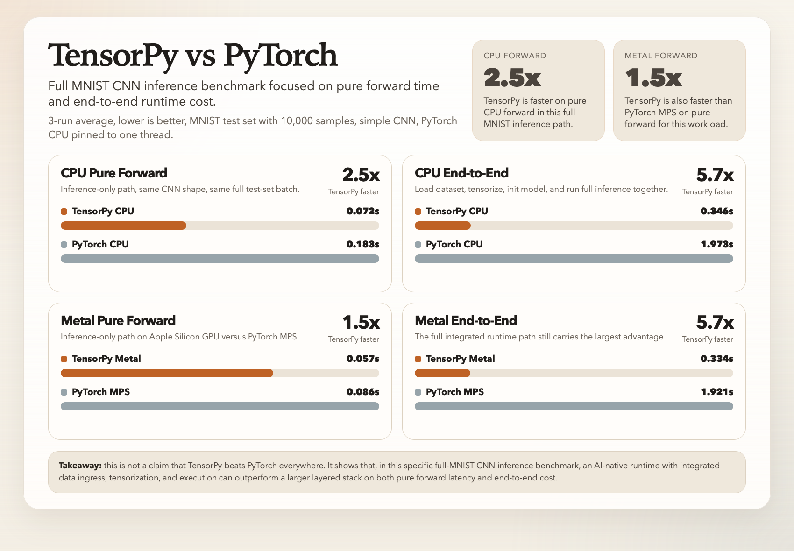

# TensorPy

TensorPy is an AI-native Python interpreter written in C.

It is not a thin scripting layer over an external ML stack. The runtime owns the language core, object model, garbage collector, tensor system, autograd path, portability layer, concurrency primitives, and embedding surface directly.

The project goal is not full CPython compatibility. The goal is a compact, hackable, systems-oriented runtime where AI workloads are first-class runtime behavior instead of an add-on library.

Current full-MNIST benchmark snapshot:



## Why TensorPy Exists

Most modern AI applications are assembled from multiple layers:

- Python
- package imports
- data loading glue
- NumPy / pandas preprocessing
- framework runtime
- backend dispatch

That stack is powerful, but it also carries real startup cost, integration cost, and control loss.

TensorPy explores a different design:

- one runtime
- one object model
- one execution environment
- one integrated path from script to tensor to training or inference

That makes it a better fit for:

- small-model and short-run AI workloads
- embedded or OS-level integration
- interactive batch-1 pipelines
- host applications that want a compact embeddable AI runtime
- systems work where language, runtime, and ML behavior need to be tuned together

## Project Thesis

TensorPy is built around three ideas:

1. AI should be a runtime feature, not an external dependency chain.
2. A smaller and more integrated stack can beat larger frameworks on end-to-end latency, not just on code size.
3. Rebuilding the stack from the interpreter upward is a practical way to understand and control execution, memory, scheduling, and device behavior.

## What It Already Includes

### Language Core

- Python-like expressions, statements, loops, slicing, and container literals
- Functions, lambdas, closures, and `*args`
- Classes, inheritance, and `super()`
- Exceptions with `try` / `except`
- REPL and script execution
- Module imports, package imports, and module caching

### Runtime

- Bytecode compiler and VM
- Mark-and-sweep garbage collector
- Platform abstraction layer for filesystem, time, random, threads, and process-facing operations
- Shared memory abstraction and ongoing cleanup of allocator routing
- Public scalar embedding API via [`include/tensorpy/api.h`](/Users/tensorcraft/Projects/TensorPy/include/tensorpy/api.h)

### Systems Primitives

- Threads
- Mutexes
- Condition variables
- Atomics
- Thread pool
- `parallel_for`

### Tensor / ML Runtime

- Native `tensor`, `device`, and `dtype` objects
- CPU eager ops for float32 tensors
- Autograd subset for practical training loops
- CPU scalar, SIMD, and threaded execution paths
- Apple Silicon Metal backend with explicit opt-in execution
- Native data ingress helper for MNIST CSV via `ml.load_mnist_csv(...)`

### NN Stack

- `Module`
- `Linear`
- `Conv2d`
- `ReLU`
- `Sigmoid`
- `Tanh`
- `Flatten`
- `Sequential`
- `Embedding`
- `RNN`, `LSTM`, `GRU`
- `LogisticRegression`, `MLP`, `SimpleCNN`
- `Adam`

### Standard Library Surface

TensorPy already ships a practical built-in module set:

- `json`
- `re`
- `math`
- `time`
- `random`
- `os`
- `io`
- `path`
- `logging`
- `traceback`
- `sys`
- `collections`
- `itertools`
- `functools`
- `env`
- `config`
- `host`
- `array`
- `ml`
- `types`
- `inspect`

For tracked implementation status, see [ROADMAP.md](/Users/tensorcraft/Projects/TensorPy/ROADMAP.md).

## What Makes It Different

TensorPy is not trying to be a smaller PyTorch clone or a general Python reimplementation.

The defining property is integration:

- the interpreter understands tensors directly
- the runtime exposes ML and systems primitives natively
- data ingestion, tensor creation, training steps, and inference stay inside one runtime
- host embedding does not require pulling in a separate Python runtime plus a separate ML framework

That is the core product idea: a compact AI runtime, not a toy language.

## Benchmarks

The most important comparison for TensorPy is not peak CUDA throughput. A pure C++ or CUDA stack should win that contest.

The more relevant test is whether a smaller integrated runtime can beat a layered Python stack on end-to-end AI work, especially for:

- cold starts
- AI imports
- batch-1 execution
- short runs
- small models
- embedded-style execution paths

### Current Full-MNIST Inference Benchmark

Benchmark harness:

- [`benchmarks/run_full_mnist_inference.py`](/Users/tensorcraft/Projects/TensorPy/benchmarks/run_full_mnist_inference.py)
- [`benchmarks/full_mnist_inference_tensorpy.py`](/Users/tensorcraft/Projects/TensorPy/benchmarks/full_mnist_inference_tensorpy.py)
- [`benchmarks/full_mnist_inference_pytorch.py`](/Users/tensorcraft/Projects/TensorPy/benchmarks/full_mnist_inference_pytorch.py)
- [`benchmarks/run_benchmark_matrix.py`](/Users/tensorcraft/Projects/TensorPy/benchmarks/run_benchmark_matrix.py)
- [`benchmarks/mnist_cnn_tensorpy.py`](/Users/tensorcraft/Projects/TensorPy/benchmarks/mnist_cnn_tensorpy.py)
- [`benchmarks/mnist_cnn_pytorch.py`](/Users/tensorcraft/Projects/TensorPy/benchmarks/mnist_cnn_pytorch.py)

Configuration:

- simple CNN
- full MNIST test set (`10,000` samples)
- inference-only benchmark plus end-to-end runtime breakdown
- single-threaded PyTorch baseline
- PyTorch MPS baseline on Apple Silicon
- 3-run averages

Current results:

| Scenario | TensorPy | PyTorch | Result |
| --- | ---: | ---: | --- |
| CPU pure forward | 0.0723s | 0.1834s | TensorPy wins by 2.5x |
| CPU end-to-end overall | 0.3465s | 1.9726s | TensorPy wins by 5.7x |
| Metal pure forward | 0.0575s | 0.0862s | TensorPy wins by 1.5x |
| Metal end-to-end overall | 0.3342s | 1.9206s | TensorPy wins by 5.7x |

Interpretation:

- In this specific benchmark, TensorPy wins on both pure forward latency and end-to-end runtime.
- The biggest end-to-end gains still come from integration: native CSV ingress, lower tensorization cost, and a tighter runtime path.
- This is not a general claim that TensorPy beats PyTorch in all workloads or at all scales.
- The useful claim is narrower and more systems-oriented: in a compact full-stack inference path, an AI-native runtime can outperform a broader layered stack.

That is the intended design center.

## Example

### ML Runtime

```python
import ml

x = ml.tensor([[1, 2], [3, 4]])
print(x.shape)
print(ml.add(x, x).sum())

if ml.metal_available():
    y = ml.ones(4, ml.float32, ml.metal)
    print(y.device.name)
    print(ml.mul(y, 3).sum())
```

### Training Loop

```python
import ml

x = ml.tensor([[1], [2], [3], [4]])
y = ml.tensor([[3], [5], [7], [9]])

w = ml.Parameter([[0]])
b = ml.Parameter([0])

for _ in range(200):
    ml.zero_grad([w, b])
    pred = ml.add(ml.matmul(x, w), b)
    loss = ml.mse_loss(pred, y)
    loss.backward()
    ml.sgd_step([w, b], 0.05)

print(w.item(), b.item())
```

### Integrated Data Ingress

```python
import ml

images, labels = ml.load_mnist_csv("data/mnist/mnist_train_200.csv", 32)
print(len(images), len(labels))
```

## Build

Build the default runtime:

```bash
make
```

Build without Metal:

```bash
make METAL=0
```

The resulting binary is:

```bash
./tensorpy
```

## Usage

Run a script:

```bash
./tensorpy path/to/script.py
```

Run one command:

```bash
./tensorpy -c "print(1 + 2)"
```

Start the REPL:

```bash
./tensorpy
```

## Testing

Run the full regression suite:

```bash
python3 run_tests.py
```

Run the benchmark matrix:

```bash
python3 benchmarks/run_benchmark_matrix.py
```

## Embedding

TensorPy includes a minimal public C API:

- [`include/tensorpy/api.h`](/Users/tensorcraft/Projects/TensorPy/include/tensorpy/api.h)

Current scope:

- create and destroy a `TPContext`
- interpret code in that context
- read and write scalar globals
- inspect the last runtime error
- register scalar-only host-native modules and functions

Detailed notes live in:

- [docs/C_API_READINESS.md](/Users/tensorcraft/Projects/TensorPy/docs/C_API_READINESS.md)

## Project Layout

- [src/main.c](/Users/tensorcraft/Projects/TensorPy/src/main.c): CLI and REPL entry point
- [src/compiler.c](/Users/tensorcraft/Projects/TensorPy/src/compiler.c): parser and bytecode compiler
- [src/vm.c](/Users/tensorcraft/Projects/TensorPy/src/vm.c): VM and runtime behavior
- [src/builtins.c](/Users/tensorcraft/Projects/TensorPy/src/builtins.c): builtins, tensor ops, autograd helpers, and native modules
- [src/platform.c](/Users/tensorcraft/Projects/TensorPy/src/platform.c): portability layer
- [modules](/Users/tensorcraft/Projects/TensorPy/modules): TensorPy standard-library-style modules
- [tests](/Users/tensorcraft/Projects/TensorPy/tests): regression coverage
- [benchmarks](/Users/tensorcraft/Projects/TensorPy/benchmarks): benchmark harnesses and runtime comparisons

## Limitations

TensorPy is already useful for runtime experimentation, systems prototyping, embedding work, and compact ML execution paths. It is not yet:

- a drop-in replacement for CPython
- a full PyTorch replacement
- a peak-throughput CUDA framework

Known gaps still include:

- incomplete Python compatibility in advanced edge cases
- partial standard library coverage
- incomplete Metal kernel coverage for several training-critical ops
- no public container/callable ABI in the embedding surface yet
- more optimization headroom in `matmul`, reductions, and eval-heavy paths

## Near-Term Direction

Near-term priorities are:

- continue improving end-to-end AI pipeline performance, not just isolated kernels
- push more data ingress and preprocessing into the runtime where that improves latency
- improve CPU `matmul` and additional kernel performance
- reduce Metal synchronization overhead
- expand benchmark coverage for embedded and always-on host-runtime scenarios
- keep hardening TensorPy as an embeddable AI runtime rather than a language demo

## Status

TensorPy is an active systems project focused on building a compact AI-native runtime from the interpreter upward.

If you are interested in interpreter design, ML runtime internals, compact host embedding, or end-to-end control over AI execution, this repository is aimed at that space.
